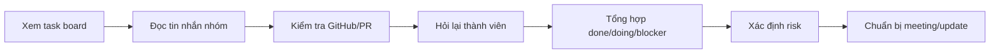
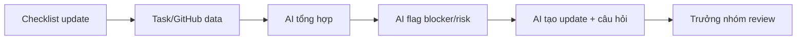

# 02 — Group Problem Statement

## Group convergence

Nhóm gom các vấn đề đã scan thành các cụm chính.

| Cluster | Candidate examples | Pattern chung |
|---|---|---|
| Tổng hợp thông tin | Dev Weekly Report, Progress & Blocker Summary  | Gom thông tin từ nhiều nguồn rồi review |
| Lên kế hoạch, xử lý | Priority Order, Risk Management, Late Blocker Detection | Lên kế hoạch cho dự án, xử lý các biến cố |
| Cập nhật | Scattered Team Updates, Repetitive Data Entry Inefficiency  | Cập nhật các chức năng của dự án |
| Tìm kiếm thông tin | Multi-Channel Communication Overhead, Lost in Discord Logs | Tìm kiếm thông tin từ các kênh khác nhau |

## Shortlist

| Candidate | Actor rõ | Workflow rõ | Pain có evidence | Impact đo được | Làm trong lab | So sánh R/W/A được | Nhóm hiểu domain | Tổng |
|---|---:|---:|---:|---:|---:|---:|---:|---:|
| Multi-Channel Communication Overhead | 5 | 5 | 4 | 5 | 4 | 5 | 5 | 33 |
| Dev Weekly Report | 4 | 4 | 4 | 4 | 3 | 4 | 5 | 28 |
| Progress & Blocker Summary | 4 | 5 | 3 | 5 | 5 | 4 | 4 | 30 |

## Vấn đề nhóm chọn

**Multi-Channel Communication Overhead.**

## Vì sao chọn vấn đề này

Requirement thường nằm ở nhiều nơi khác nhau như email, slide, Notion, Discord hoặc chat nhóm, khiến người thực hiện phải mất thời gian tìm kiếm và đối chiếu thông tin.
Đây là vấn đề có impact lớn và xảy ra thường xuyên đối với sinh viên hoặc thành viên dự án khi nhận task.
Pain point cụ thể và dễ đo lường
Bài toán phù hợp với AI vì AI có thể đọc nhiều nguồn dữ liệu, tổng hợp requirement, trích xuất checklist và highlight những phần quan trọng cho người dùng

## Vì sao không chọn các bài khác:

Dev Weekly Report: chỉ diễn ra một lần mỗi tuần, phạm vi ảnh hưởng nhỏ hơn.
Review PRD: Bài toán này phụ thuộc vào việc dữ liệu tiến độ đã được cập nhật đầy đủ và chính xác.

## Quick validation

Nhóm hỏi nhanh 3 sinh viên và 3 thành viên dự án đã từng nhận task từ nhiều nguồn khác nhau.

| Nguồn               | Số người | Tín hiệu xác nhận                                                                                                                      | Tín hiệu phản bác                                                           | Nhóm sửa problem thế nào                                                                                          |
| ------------------- | -------: | -------------------------------------------------------------------------------------------------------------------------------------- | --------------------------------------------------------------------------- | ----------------------------------------------------------------------------------------------------------------- |
| Quick interview     |        3 | 3/3 người cho biết requirement thường nằm ở nhiều nơi như Discord, Notion, slide và chat nhóm; đều từng phải hỏi lại vì sợ sót yêu cầu | 1 người cho rằng nếu dự án có quy trình tốt thì chỉ cần đọc Notion là đủ    | Thu hẹp problem: không phải "quản lý toàn bộ giao tiếp", mà là "tổng hợp requirement của một task từ nhiều nguồn" |
| Mini poll trong lớp |        6 | 5/6 từng mất hơn 20 phút để tìm và đối chiếu thông tin trước khi bắt đầu làm bài tập hoặc project                                      | Một số người cho rằng với task đơn giản thì chỉ cần checklist hoặc template | Thêm non-AI alternative: chuẩn hóa nơi lưu requirement và checklist task                                          |

Insight sau validation:

```
Pain thật không nằm ở việc tìm kiếm từng nguồn thông tin riêng lẻ.
Pain nằm ở việc phải tự tổng hợp và đối chiếu nhiều nguồn rời rạc để hiểu đầy đủ requirement của một task, dẫn đến mất thời gian và dễ bỏ sót thông tin quan trọng.
```

## Research ngắn

| Hướng/tool | Giải quyết phần nào | Điểm mạnh | Khoảng trống |
|---|---|---|---|
| Jira/Trello dashboard | Hiển thị task/status | Tốt cho dữ liệu có cấu trúc | Không gom đủ chat/GitHub/context |
| GitHub Projects/PR | Theo dõi issue, PR, review | Gắn sát code | Không thể hiện đầy đủ impact dự án |
| Checklist daily | Chuẩn hóa update | Dễ áp dụng | Vẫn cần người tổng hợp |
| AI summarization | Tóm tắt thông tin rời rạc | Hữu ích cho tổng hợp | Cần người kiểm tra để tránh sai |

## Current workflow

```text
CURRENT STATE

[1 Xem task board]
→ [2 Đọc tin nhắn nhóm]
→ [3 Kiểm tra GitHub/PR]
→ [4 Hỏi lại thành viên]
→ [5 Tổng hợp done/doing/blocker]
→ [6 Xác định risk]
→ [7 Chuẩn bị meeting/update]
```



## Future workflow

```text
FUTURE STATE

[1 Thành viên update theo checklist ngắn]
→ [2 Pull dữ liệu task/GitHub]
→ [3 AI tổng hợp theo người/module]
→ [4 AI flag blocker/risk]
→ [5 AI tạo bản update ngắn + câu hỏi cần hỏi]
→ [6 Trưởng nhóm review và quyết định]
```



## Problem Statement v1

| Field | Nội dung |
|---|---|
| Actor | Trưởng nhóm phần mềm quản lý team 15 người |
| Workflow | Xem task board → đọc chat → kiểm tra GitHub/PR → hỏi lại thành viên → tổng hợp tiến độ → xác định risk → chuẩn bị update |
| Bottleneck | Tổng hợp thông tin rời rạc và phát hiện blocker/risk |
| Impact | Mất khoảng 60–90 phút; dễ bỏ sót blocker; rủi ro deadline bị phát hiện muộn |
| Success metric | Giảm thời gian chuẩn bị xuống dưới 30 phút; giảm số lần hỏi lại; giảm blocker phát hiện muộn |
| Boundary | AI không tự giao việc, không đánh giá năng lực cá nhân, không tự gửi báo cáo |
| AI intervention point | Sau khi có dữ liệu update/task/PR, AI hỗ trợ tổng hợp và flag risk trước khi trưởng nhóm review |
| Mức chọn | Workflow |

## Rule / Workflow / Agent

| Mức | Phương án | Khi nào đủ | Rủi ro | Chọn? |
|---|---|---|---|---|
| Rule | Checklist, template update, dashboard task | Đủ nếu team update rất đều và task đơn giản | Không xử lý tốt thông tin rời rạc | Dùng một phần |
| Workflow | Checklist/task data → AI tổng hợp → AI flag risk → trưởng nhóm review | Phù hợp vì quy trình rõ và có người kiểm soát | AI có thể hiểu sai nếu input thiếu | Chọn |
| Agent | Agent tự hỏi thành viên, tự escalate, tự giao lại task | Chỉ phù hợp khi hệ thống rất trưởng thành | Rủi ro cao, ảnh hưởng con người | Chưa chọn |

## Final decision

**Go với scope nhỏ: chọn hướng Workflow.**

Pilot nhỏ nhất:

- Dùng dữ liệu của 1 sprint hoặc 1 tuần.
- Mỗi thành viên cập nhật: task đang làm, tiến độ, blocker, deadline.
- AI tạo bản tổng hợp gồm: done, doing, blocker, risk, câu hỏi cần hỏi.
- Trưởng nhóm đo thời gian review và số lỗi phải sửa.

Rollback:

- Nếu AI bỏ sót blocker quan trọng hoặc phải sửa quá nhiều, quay về checklist + dashboard.
- Nếu dữ liệu đầu vào thiếu, yêu cầu chuẩn hóa checklist trước khi dùng AI.
