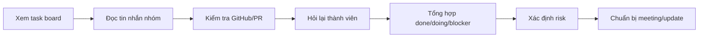
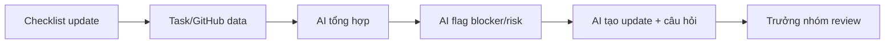

# 02 — Group Problem Statement

## Group convergence

Nhóm gom các vấn đề đã scan thành các cụm chính.

| Cluster | Candidate examples | Pattern chung |
|---|---|---|
| Tổng hợp tiến độ | Tổng hợp task, chuẩn bị daily/weekly update | Trưởng nhóm phải gom thông tin từ nhiều nguồn |
| Blocker và rủi ro | Task trễ, blocker bị phát hiện muộn, dependency giữa thành viên | Khó nhìn ra vấn đề thật trước khi deadline đến gần |
| Giao tiếp trong nhóm | Update thiếu rõ ràng, phải hỏi lại nhiều lần | Thông tin rời rạc làm meeting kéo dài |
| Báo cáo cho quản lý | Cần báo cáo tình trạng dự án nhanh | Người quản lý cần context nhưng dữ liệu chưa sẵn |

## Shortlist

| Candidate | Actor rõ | Workflow rõ | Pain có thật | Impact đo được | Có thể dùng AI đúng chỗ | Tổng |
|---|---:|---:|---:|---:|---:|---:|
| Tổng hợp tiến độ và blocker của team 15 người | 5 | 5 | 5 | 5 | 5 | 25 |
| Phát hiện blocker muộn | 5 | 4 | 5 | 4 | 4 | 22 |
| Tự động chuẩn bị báo cáo meeting | 4 | 5 | 4 | 4 | 4 | 21 |

## Vấn đề nhóm chọn

**Trưởng nhóm phần mềm quản lý 15 người mất nhiều thời gian để tổng hợp tiến độ, phát hiện blocker và xác định rủi ro vì thông tin nằm rải rác ở task board, GitHub và tin nhắn nhóm.**

## Vì sao chọn vấn đề này

- Có actor rõ: trưởng nhóm phần mềm.
- Có workflow lặp lại: trước daily/weekly/sprint review.
- Có pain thật: phải đọc nhiều nguồn và hỏi lại nhiều người.
- Có impact đo được: thời gian chuẩn bị, số blocker bị bỏ sót, số lần hỏi lại.
- Có thể so sánh Rule / Workflow / Agent rõ ràng.
- Có human boundary rõ: AI chỉ hỗ trợ tổng hợp, trưởng nhóm vẫn quyết định.

## Quick validation

Nhóm có thể validate nhanh bằng cách hỏi trưởng nhóm đồ án, trưởng nhóm thực tập hoặc những người từng quản lý team phần mềm.

| Nguồn | Tín hiệu xác nhận | Tín hiệu phản bác | Điều chỉnh |
|---|---|---|---|
| Trưởng nhóm đồ án | Thường phải hỏi lại từng thành viên trước khi báo cáo | Team nhỏ thì không quá đau | Thu hẹp vào team khoảng 15 người |
| Developer trong team | Update thường nằm ở chat, task board và commit | Nếu team update rất kỷ luật thì pain giảm | Thêm non-AI alternative là checklist |
| Người quản lý/mentor | Cần biết blocker và risk nhanh | Không muốn AI tự quyết định | Giữ human review ở cuối workflow |

## Research ngắn

| Hướng/tool | Giải quyết phần nào | Điểm mạnh | Khoảng trống |
|---|---|---|---|
| Jira/Trello dashboard | Hiển thị task/status | Tốt cho dữ liệu có cấu trúc | Không gom đủ chat/GitHub/context |
| GitHub Projects/PR | Theo dõi issue, PR, review | Gắn sát code | Không thể hiện đầy đủ impact dự án |
| Checklist daily | Chuẩn hóa update | Dễ áp dụng | Vẫn cần người tổng hợp |
| AI summarization | Tóm tắt thông tin rời rạc | Hữu ích cho tổng hợp | Cần người kiểm tra để tránh sai |

## Current workflow

```text
CURRENT STATE

[1 Xem task board]
→ [2 Đọc tin nhắn nhóm]
→ [3 Kiểm tra GitHub/PR]
→ [4 Hỏi lại thành viên]
→ [5 Tổng hợp done/doing/blocker]
→ [6 Xác định risk]
→ [7 Chuẩn bị meeting/update]
```



## Future workflow

```text
FUTURE STATE

[1 Thành viên update theo checklist ngắn]
→ [2 Pull dữ liệu task/GitHub]
→ [3 AI tổng hợp theo người/module]
→ [4 AI flag blocker/risk]
→ [5 AI tạo bản update ngắn + câu hỏi cần hỏi]
→ [6 Trưởng nhóm review và quyết định]
```



## Problem Statement v1

| Field | Nội dung |
|---|---|
| Actor | Trưởng nhóm phần mềm quản lý team 15 người |
| Workflow | Xem task board → đọc chat → kiểm tra GitHub/PR → hỏi lại thành viên → tổng hợp tiến độ → xác định risk → chuẩn bị update |
| Bottleneck | Tổng hợp thông tin rời rạc và phát hiện blocker/risk |
| Impact | Mất khoảng 60–90 phút; dễ bỏ sót blocker; rủi ro deadline bị phát hiện muộn |
| Success metric | Giảm thời gian chuẩn bị xuống dưới 30 phút; giảm số lần hỏi lại; giảm blocker phát hiện muộn |
| Boundary | AI không tự giao việc, không đánh giá năng lực cá nhân, không tự gửi báo cáo |
| AI intervention point | Sau khi có dữ liệu update/task/PR, AI hỗ trợ tổng hợp và flag risk trước khi trưởng nhóm review |
| Mức chọn | Workflow |

## Rule / Workflow / Agent

| Mức | Phương án | Khi nào đủ | Rủi ro | Chọn? |
|---|---|---|---|---|
| Rule | Checklist, template update, dashboard task | Đủ nếu team update rất đều và task đơn giản | Không xử lý tốt thông tin rời rạc | Dùng một phần |
| Workflow | Checklist/task data → AI tổng hợp → AI flag risk → trưởng nhóm review | Phù hợp vì quy trình rõ và có người kiểm soát | AI có thể hiểu sai nếu input thiếu | Chọn |
| Agent | Agent tự hỏi thành viên, tự escalate, tự giao lại task | Chỉ phù hợp khi hệ thống rất trưởng thành | Rủi ro cao, ảnh hưởng con người | Chưa chọn |

## Final decision

**Go với scope nhỏ: chọn hướng Workflow.**

Pilot nhỏ nhất:

- Dùng dữ liệu của 1 sprint hoặc 1 tuần.
- Mỗi thành viên cập nhật: task đang làm, tiến độ, blocker, deadline.
- AI tạo bản tổng hợp gồm: done, doing, blocker, risk, câu hỏi cần hỏi.
- Trưởng nhóm đo thời gian review và số lỗi phải sửa.

Rollback:

- Nếu AI bỏ sót blocker quan trọng hoặc phải sửa quá nhiều, quay về checklist + dashboard.
- Nếu dữ liệu đầu vào thiếu, yêu cầu chuẩn hóa checklist trước khi dùng AI.
