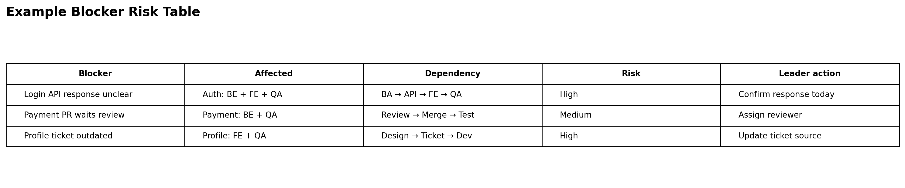

# Software Team Blocker Risk Radar

## 1. Project Overview

Dự án này đề xuất một workflow dùng AI để hỗ trợ trưởng nhóm phần mềm phát hiện, phân loại và xử lý **blocker ẩn** trong một team 15 người.

Điểm chính của bài không phải là “AI viết báo cáo”, mà là:

> Làm thế nào để trưởng nhóm phát hiện sớm task bị kẹt, dependency giữa các thành viên và rủi ro ảnh hưởng deadline trước khi vấn đề trở nên nghiêm trọng.

## 2. One-sentence Problem

Trưởng nhóm phần mềm quản lý 15 người thường phát hiện blocker quá muộn vì tín hiệu về task bị kẹt, phụ thuộc chéo và rủi ro deadline nằm rải rác trong task board, GitHub và tin nhắn nhóm.

## 3. Actor

Actor chính là **trưởng nhóm phần mềm** đang quản lý một team 15 người, gồm:

- Backend developers
- Frontend developers
- Tester / QA
- UI/UX designer
- Business Analyst
- DevOps hoặc technical support nếu có

Trưởng nhóm cần theo dõi tiến độ, xử lý blocker, điều phối dependency và bảo vệ deadline của sprint/project.

## 4. Context

Trong một sprint, mỗi thành viên có nhiều task đang chạy. Một số task phụ thuộc vào người khác:

- Frontend chờ backend hoàn thành API.
- Tester chờ build ổn định.
- Backend chờ BA xác nhận requirement.
- Developer chờ UI/UX cập nhật design.
- Một pull request bị review lâu làm task tiếp theo bị chậm.
- Một task “In Progress” quá lâu nhưng không ai báo là blocker.

Các blocker này thường không hiện rõ trên dashboard. Trưởng nhóm chỉ phát hiện khi hỏi từng người trong daily meeting hoặc khi task đã trễ deadline.

## 5. Current Workflow

```text
CURRENT STATE — Blocker handling thủ công

[1 Xem task board]
→ [2 Kiểm tra task In Progress quá lâu]
→ [3 Đọc comment trong Jira/Trello/GitHub]
→ [4 Đọc tin nhắn nhóm để tìm dấu hiệu bị kẹt]
→ [5 Hỏi từng thành viên trong daily]
→ [6 Tự đoán task nào đang block task khác]
→ [7 Quyết định escalate / reassign / follow-up]
```


## 6. Bottleneck

Bottleneck chính không nằm ở việc viết báo cáo.

Bottleneck nằm ở việc trưởng nhóm phải tự ghép nhiều tín hiệu nhỏ để nhận ra:

- Blocker thật là gì.
- Ai hoặc module nào đang bị ảnh hưởng.
- Task nào đang phụ thuộc task nào.
- Blocker nào cần xử lý ngay.
- Blocker nào chỉ là thiếu thông tin.
- Risk nào có thể ảnh hưởng sprint deadline.

Ví dụ:

```text
Frontend nói: "Em đang chờ API login."
Backend nói: "API login đang chờ xác nhận format response."
BA nói: "Em chưa thấy ai hỏi về format đó."

=> Đây không chỉ là 3 update riêng lẻ.
=> Đây là một dependency chain đang làm chậm module login.
```

## 7. Impact

Với team 15 người, nếu mỗi người có 3–5 task đang mở, trưởng nhóm có thể phải theo dõi khoảng 45–75 task cùng lúc.

Nếu blocker bị phát hiện muộn, hậu quả có thể là:

- Task trễ nhưng không ai xử lý kịp.
- Thành viên chờ nhau mà trưởng nhóm không biết.
- Daily meeting chỉ nghe update rời rạc, không thấy dependency.
- Tester hoặc frontend bị chậm vì backend/API/design chưa sẵn sàng.
- Rủi ro deadline chỉ được phát hiện khi sprint gần kết thúc.

## 8. Success Metrics

| Metric | Trước | Sau kỳ vọng |
|---|---:|---:|
| Thời gian tìm blocker trước daily | 45–60 phút | Dưới 15 phút |
| Số blocker bị phát hiện muộn | Cao | Giảm rõ rệt |
| Số lần phải hỏi lại để hiểu blocker | Nhiều | Giảm khoảng 50% |
| Số task In Progress lâu không có lý do | Khó kiểm soát | Được flag tự động |
| Chất lượng daily meeting | Update rời rạc | Tập trung vào blocker/action |

## 9. Proposed Future Workflow

```text
FUTURE STATE — AI-assisted Blocker Triage

[1 Thành viên update task + blocker theo format ngắn]
→ [2 AI gom blocker từ Jira/GitHub/chat update]
→ [3 AI nhóm blocker theo module/dependency]
→ [4 AI đánh dấu mức độ ảnh hưởng: Low / Medium / High]
→ [5 AI tạo danh sách câu hỏi cho daily meeting]
→ [6 Trưởng nhóm review và quyết định xử lý]
```


## 10. Expected AI Output

AI không tạo báo cáo dài. AI tạo một **Blocker Risk Table** để trưởng nhóm dùng trước daily meeting.



Ví dụ output:

| Blocker | Affected people/module | Risk level | Suggested leader action |
|---|---|---|---|
| Frontend chờ API login | Frontend + QA / Authentication | High | Hỏi backend và BA trong daily |
| PR payment chưa được review | Backend + Tester / Payment | Medium | Gán reviewer cụ thể |
| Requirement đổi nhưng ticket chưa cập nhật | Dev + QA / User Profile | High | Yêu cầu BA cập nhật ticket |

## 11. AI Intervention Point

AI can thiệp ở các điểm:

- Gom tín hiệu blocker từ update ngắn, task comment, PR status.
- Nhóm blocker theo module hoặc dependency chain.
- Flag task In Progress quá lâu nhưng không có update rõ.
- Đánh dấu blocker theo mức độ ảnh hưởng.
- Gợi ý câu hỏi trưởng nhóm nên hỏi trong daily.
- Tạo action list để trưởng nhóm review.

AI không:

- Tự đánh giá năng lực cá nhân.
- Tự trách thành viên.
- Tự reassign task.
- Tự gửi tin nhắn escalate.
- Tự quyết định thay trưởng nhóm.

## 12. Rule / Workflow / Agent Decision

| Mức | Phương án | Đánh giá | Quyết định |
|---|---|---|---|
| Rule | Bắt buộc mỗi người điền blocker trong daily form | Cần thiết để chuẩn hóa input, nhưng không phát hiện tốt blocker ẩn | Dùng một phần |
| Workflow | Gom update → AI phát hiện blocker → AI nhóm dependency → leader review | Phù hợp nhất vì giải quyết đúng bottleneck và vẫn có người kiểm soát | Chọn |
| Agent | Agent tự hỏi thành viên, tự escalate, tự reassign task | Quá rủi ro vì ảnh hưởng trực tiếp đến quản lý con người | Chưa chọn |

## 13. Final Decision

Chọn hướng **Workflow**.

Lý do:

- Problem khác với bài weekly report: trọng tâm là blocker/dependency triage, không phải viết narrative.
- Actor rõ: trưởng nhóm phần mềm.
- Bottleneck rõ: phát hiện blocker ẩn từ nhiều tín hiệu rời rạc.
- Success metric đo được.
- AI có vai trò cụ thể nhưng không thay người quản lý.
- Có thể pilot nhỏ với dữ liệu của một sprint.

## 14. Smallest Pilot

Pilot nhỏ nhất:

1. Chọn một sprint giả lập hoặc sprint gần nhất.
2. Tạo sample update cho 15 thành viên.
3. Mỗi update có:
   - Task đang làm.
   - Trạng thái.
   - Blocker nếu có.
   - Người/module đang phụ thuộc.
   - Deadline.
4. AI tạo blocker risk table.
5. Trưởng nhóm kiểm tra:
   - AI có phát hiện đúng blocker không?
   - AI có nhóm đúng dependency không?
   - AI có gợi ý câu hỏi daily hữu ích không?
   - Thời gian chuẩn bị daily có giảm không?

## 15. Repository Structure

```text
software-team-blocker-risk-radar/
├── README.md
├── docs/
│   ├── 01-problem-scan.md
│   ├── 02-selected-problem.md
│   ├── 03-current-workflow.md
│   ├── 04-future-workflow.md
│   ├── 05-rule-workflow-agent.md
│   └── 06-reflection.md
├── assets/
│   ├── current-blocker-flow.png
│   ├── future-blocker-flow.png
│   ├── blocker-risk-table.png
│   └── workflow-mermaid.md
├── prompts/
│   └── blocker-triage-prompt.md
├── examples/
│   ├── sample-team-updates.md
│   └── sample-ai-output.md
└── research/
    └── research-notes.md
```
