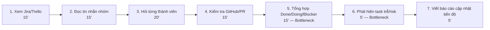
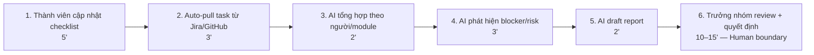

# Workflow Mermaid

## Current workflow

```mermaid
flowchart LR
    A["1. Xem Jira/Trello<br/>15'"] --> B["2. Đọc tin nhắn nhóm<br/>15'"]
    B --> C["3. Hỏi từng thành viên<br/>20'"]
    C --> D["4. Kiểm tra GitHub/PR<br/>15'"]
    D --> E["5. Tổng hợp Done/Doing/Blocker<br/>15' — Bottleneck"]
    E --> F["6. Phát hiện task trễ/risk<br/>5' — Bottleneck"]
    F --> G["7. Viết báo cáo cập nhật tiến độ<br/>5'"]
```

## Future workflow

```mermaid
flowchart LR
    A["1. Thành viên cập nhật checklist<br/>5'"] --> B["2. Auto-pull task từ Jira/GitHub<br/>3'"]
    B --> C["3. AI tổng hợp theo người/module<br/>2'"]
    C --> D["4. AI phát hiện blocker/risk<br/>3'"]
    D --> E["5. AI draft report<br/>2'"]
    E --> F["6. Trưởng nhóm review + quyết định<br/>10–15' — Human boundary"]
```
