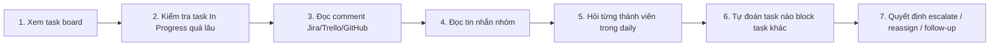
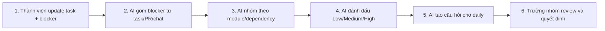

# Workflow Mermaid

## Current Blocker Flow

```mermaid
flowchart LR
    A["1. Xem task board"] --> B["2. Kiểm tra task In Progress quá lâu"]
    B --> C["3. Đọc comment Jira/Trello/GitHub"]
    C --> D["4. Đọc tin nhắn nhóm"]
    D --> E["5. Hỏi từng thành viên trong daily"]
    E --> F["6. Tự đoán task nào block task khác"]
    F --> G["7. Quyết định escalate / reassign / follow-up"]
```

## Future Blocker Flow

```mermaid
flowchart LR
    A["1. Thành viên update task + blocker"] --> B["2. AI gom blocker từ task/PR/chat"]
    B --> C["3. AI nhóm theo module/dependency"]
    C --> D["4. AI đánh dấu Low/Medium/High"]
    D --> E["5. AI tạo câu hỏi cho daily"]
    E --> F["6. Trưởng nhóm review và quyết định"]
```
