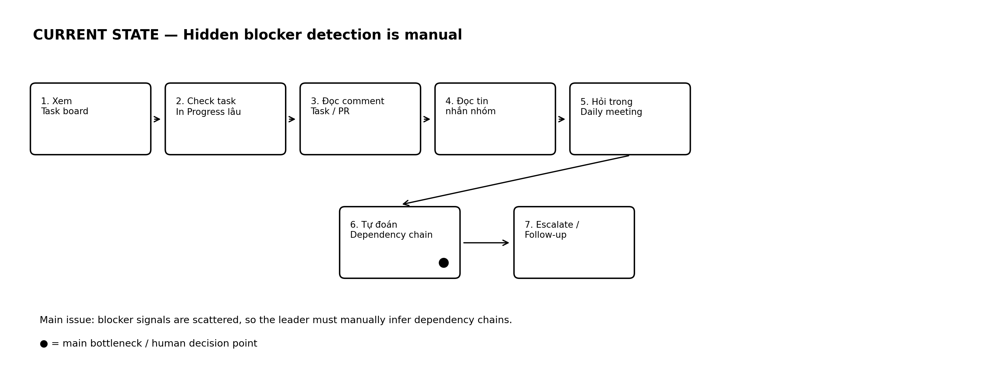

# 03 — Current Workflow

## Current State

```text
CURRENT STATE — Blocker handling thủ công

[1 Xem task board]
→ [2 Kiểm tra task In Progress quá lâu]
→ [3 Đọc comment trong Jira/Trello/GitHub]
→ [4 Đọc tin nhắn nhóm để tìm dấu hiệu bị kẹt]
→ [5 Hỏi từng thành viên trong daily]
→ [6 Tự đoán task nào đang block task khác]
→ [7 Quyết định escalate / reassign / follow-up]
```

## Current Flow Image



## Phân tích từng bước

| Bước | Việc trưởng nhóm làm | Vấn đề |
|---|---|---|
| 1 | Xem task board | Board chỉ thể hiện status, không luôn thể hiện blocker thật |
| 2 | Kiểm tra task In Progress quá lâu | Phải tự đoán task nào bất thường |
| 3 | Đọc comment trong Jira/Trello/GitHub | Comment rời rạc, dễ sót |
| 4 | Đọc tin nhắn nhóm | Nhiều nhiễu, khó tìm tín hiệu quan trọng |
| 5 | Hỏi từng thành viên | Tốn thời gian, daily dễ kéo dài |
| 6 | Tự đoán dependency | Phụ thuộc chéo khó nhìn nếu không có sơ đồ |
| 7 | Quyết định xử lý | Quyết định có thể chậm vì thiếu context |

## Bottleneck

Bottleneck chính là bước 6: trưởng nhóm phải tự đoán task nào đang block task khác.

Vấn đề không chỉ là thiếu thông tin. Vấn đề là thông tin có nhưng bị phân tán, khiến trưởng nhóm phải tự ghép lại thành dependency chain.

## Example

```text
Update A:
Frontend đang làm màn hình login, nhưng chưa gọi được API.

Update B:
Backend đã tạo API login nhưng chưa chốt response format.

Update C:
BA chưa xác nhận field "userRole" trong response.

=> Blocker thật:
Login module bị block bởi requirement chưa rõ. Frontend và QA đều bị ảnh hưởng.
```
