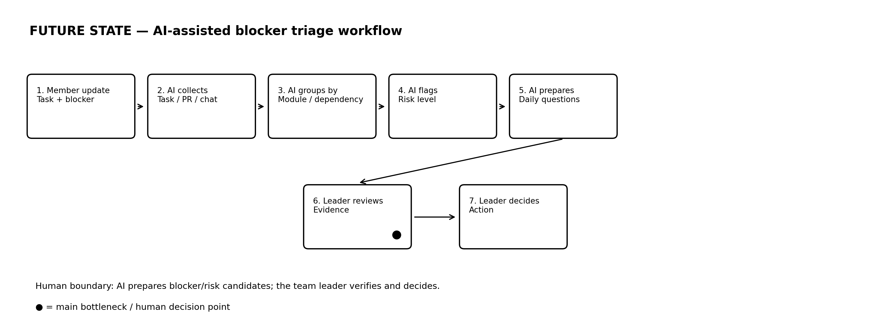

# 04 — Future Workflow

## Future State

```text
FUTURE STATE — AI-assisted Blocker Triage

[1 Thành viên update task + blocker theo format ngắn]
→ [2 AI gom blocker từ Jira/GitHub/chat update]
→ [3 AI nhóm blocker theo module/dependency]
→ [4 AI đánh dấu mức độ ảnh hưởng: Low / Medium / High]
→ [5 AI tạo danh sách câu hỏi cho daily meeting]
→ [6 Trưởng nhóm review và quyết định xử lý]
```

## Future Flow Image



## Mục tiêu của future workflow

Future workflow không cố thay trưởng nhóm. Mục tiêu là giúp trưởng nhóm có một **blocker risk radar** trước daily meeting.

AI sẽ tạo:

- Blocker list.
- Dependency chain.
- Risk level.
- Affected member/module.
- Suggested leader action.
- Questions for daily meeting.

## Expected Output

| Blocker | Affected people/module | Risk level | Suggested leader action |
|---|---|---|---|
| Frontend chờ API login | Frontend + QA / Authentication | High | Hỏi backend và BA trong daily |
| PR payment chưa được review | Backend + Tester / Payment | Medium | Gán reviewer cụ thể |
| Requirement đổi nhưng ticket chưa cập nhật | Dev + QA / User Profile | High | Yêu cầu BA cập nhật ticket |

## Human Boundary

Trưởng nhóm vẫn phải:

- Kiểm tra blocker có thật không.
- Xác nhận thông tin còn thiếu.
- Quyết định xử lý blocker nào trước.
- Giao việc hoặc escalate nếu cần.
- Chịu trách nhiệm cuối cùng với team.

AI không được tự:

- Nhắn tin trách thành viên.
- Reassign task.
- Escalate lên quản lý.
- Đánh giá performance cá nhân.
- Tạo quyết định quản lý cuối cùng.

## Fallback

```text
Nếu AI không chắc chắn:
- Đánh dấu "Needs confirmation".
- Ghi rõ thông tin còn thiếu.
- Đưa câu hỏi để trưởng nhóm hỏi lại trong daily.
```
